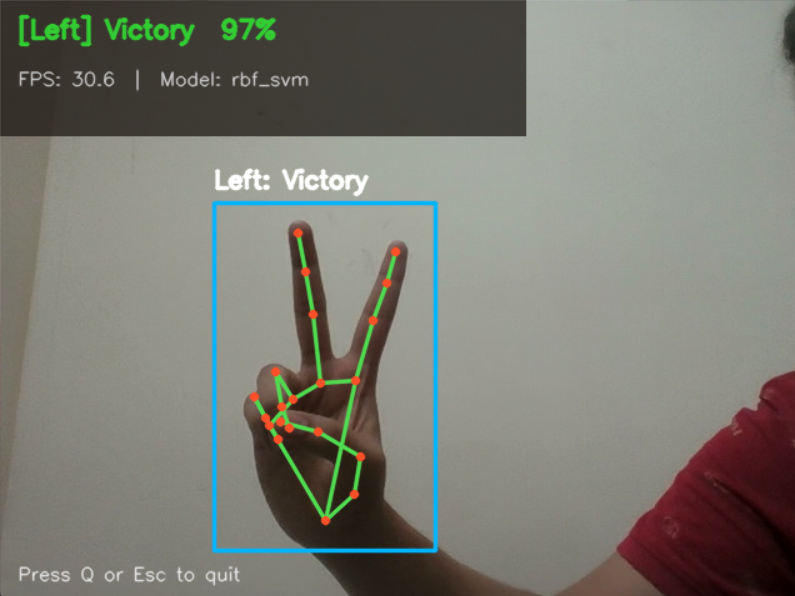
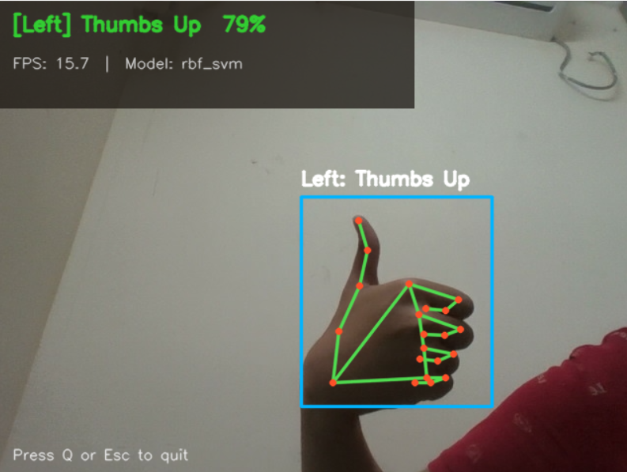
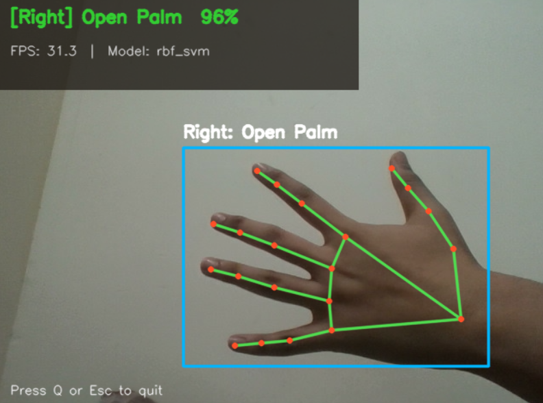
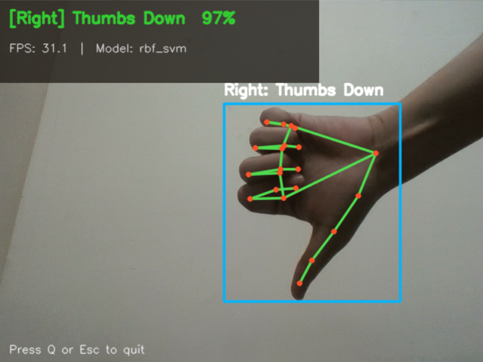
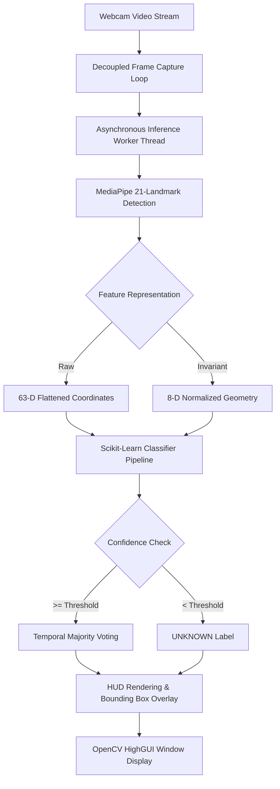
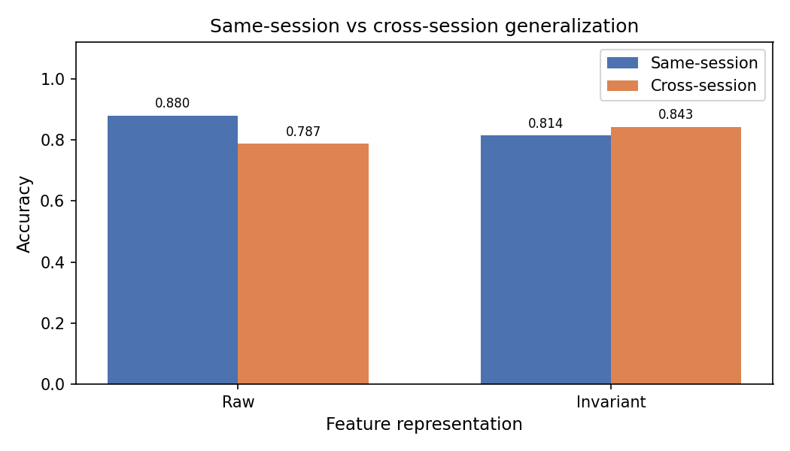
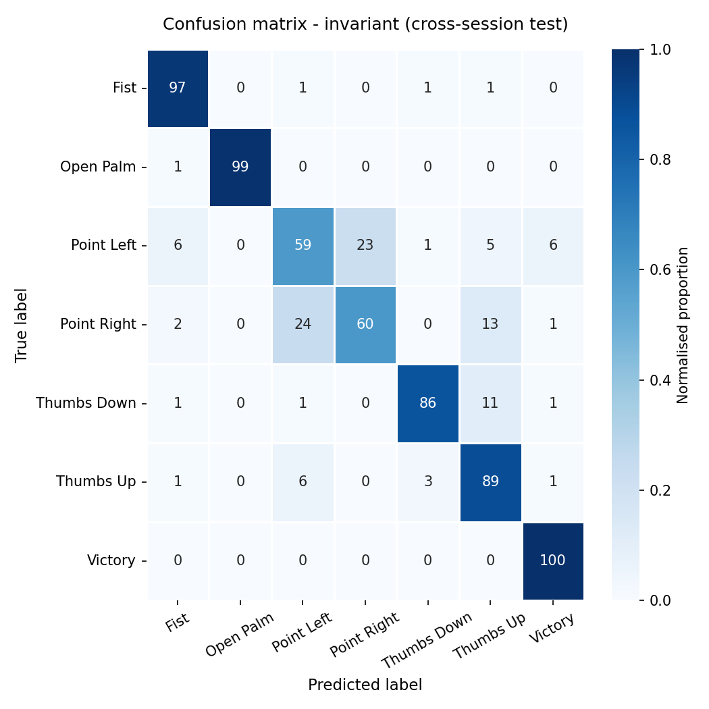

# GestureX: Real-Time Hand Gesture Recognition & Leakage-Aware Machine Learning

GestureX is an end-to-end computer vision and classical machine learning system for real-time hand gesture recognition using MediaPipe 21-landmark hand tracking. Designed with operational efficiency and statistical rigor, GestureX compares 63-dimensional raw coordinate feature representations against an 8-dimensional translation- and scale-invariant geometric representation, evaluates cross-session model generalization, and deploys real-time predictions via an asynchronous multi-threaded OpenCV application.

---

## Live Application Demonstration

The real-time webcam deployment module features low-latency multi-threaded inference, automatic hand tracking, confidence thresholding, and live FPS rendering.

<div align="center">

| 1. Left hand Victory sign | 2. Left hand Thumbs Up sign |
| :---: | :---: |
|  |  |

| 3. Right hand Open Palm sign | 4. Right hand Thumbs Down sign |
| :---: | :---: |
|  |  |

</div>

---

## Technical Highlights

- **Asynchronous Multithreaded Architecture**: Camera capture and MediaPipe / scikit-learn inference run in decoupled threads, maintaining constant frame rates (~30 FPS) without display freezing.
- **Dual Representation Comparison**: Evaluates 63-D raw coordinate vectors against 8-D scale- and translation-invariant joint distances and angles.
- **Leakage-Safe Session Splitting**: Enforces strict session-aware boundaries to evaluate model performance on unseen cross-session recordings and prevent data leakage.
- **Confidence-Aware Rejection**: Rejects ambiguous or low-confidence hand poses below a configurable probability threshold (`UNKNOWN` label).
- **Deployment Temporal Smoothing**: Applies a windowed majority-vote filter only during live video display to stabilize predictions without distorting offline metrics.

---

## System Architecture



---

## Repository Structure

```text
handgesture/
├── data/
│   ├── raw/                      # Raw landmark CSV files per session
│   └── processed/                # Prepared feature CSV datasets
├── deployment/
│   └── app.py                    # Real-time webcam application (multithreaded)
├── models/
│   ├── gesturex_best.joblib      # Production validation-selected model
│   ├── gesturex_invariant_best.joblib # Invariant feature model artifact
│   └── gesturex_raw_best.joblib  # Raw coordinate model artifact
├── results/
│   ├── class_distribution.png    # Class balance summary chart
│   ├── confusion_matrix_*.png    # Same-session & cross-session confusion matrices
│   ├── generalization_results.csv# 4-cell generalization evaluation metrics
│   └── latency_results.csv       # Repeated latency benchmark records
├── screenshot/                   # Application demonstration screenshots
├── src/
│   ├── config.py                 # Project paths, labels, hyperparameter defaults
│   ├── landmarks.py              # MediaPipe detection & drawing utilities
│   ├── features.py               # Raw and invariant feature extraction logic
│   ├── collect_data.py           # Automated webcam dataset collector
│   ├── preprocess.py             # Dataset validation & dataset split utilities
│   ├── train.py                  # Leakage-aware model cross-validation & selection
│   ├── evaluate.py               # Offline same-session & cross-session evaluation
│   └── benchmark.py              # Latency and throughput benchmark suite
├── requirements.txt              # Pinned environment dependencies
└── README.md                     # Technical documentation
```

---

## Quantitative Benchmark & Evaluation Results

### 1. Generalization Comparison Matrix

Offline evaluations demonstrate how invariant feature extraction reduces performance decay when transitioning from same-session data to held-out cross-session recording conditions.

| Feature Representation | Same-Session Accuracy | Cross-Session Accuracy | Generalization Gap |
| :--- | :---: | :---: | :---: |
| **Raw Coordinates (63-D)** | **88.00%** | 78.71% | +9.29% |
| **Invariant Features (8-D)** | 81.43% | **84.29%** | **-2.86%** |

*Note: Invariant features eliminate over-fitting to specific camera distances and background environments, achieving higher cross-session generalization.*

### 2. Generalization & Confusion Analysis

<div align="center">

| Generalization Comparison | Invariant Cross-Session Confusion Matrix |
| :---: | :---: |
|  |  |

</div>

---

## Installation & Setup

### Prerequisites
- Python 3.10, 3.11, or 3.12 (64-bit)
- OpenCV-compatible webcam

### 1. Clone Repository & Setup Virtual Environment

```bash
git clone https://github.com/tamoghnodeb/handgesture.git
cd handgesture

python -m venv .venv
```

Activate the environment:
- **Windows (PowerShell)**: `.\.venv\Scripts\Activate.ps1`
- **macOS / Linux**: `source .venv/bin/activate`

### 2. Install Dependencies

```bash
python -m pip install --upgrade pip
pip install -r requirements.txt
```

---

## Usage Guide

### 1. Run Real-Time Webcam Recognition

Launch the live application using the pre-trained invariant feature model:

```bash
python -m deployment.app --model models\gesturex_invariant_best.joblib --confidence-threshold 0.35
```

Controls:
- Press **Q** or **Esc** to quit the webcam interface.

### 2. Collect Custom Landmark Datasets

Record hand gesture samples per class with automatic frame rate throttling:

```bash
# Record all gesture classes for a new session
python -m src.collect_data --session-id session_04 --subject-id sub01 --all-gestures --samples 100
```

### 3. Model Training & Cross-Validation

Train Logistic Regression, Random Forest, and RBF Support Vector Machines across representations:

```bash
python -m src.train --data data/raw/gesture_landmarks.csv --cross-session session_03
```

### 4. Run Comprehensive Evaluation

Generate metric tables, classification reports, and confusion matrices:

```bash
python -m src.evaluate --data data/raw/gesture_landmarks.csv
```

### 5. Benchmark System Latency

Measure per-frame detection, feature extraction, and inference latency over 100 repetitions:

```bash
python -m src.benchmark
```

---

## License

This project is licensed under the MIT License - see the [LICENSE](LICENSE) file for details.
